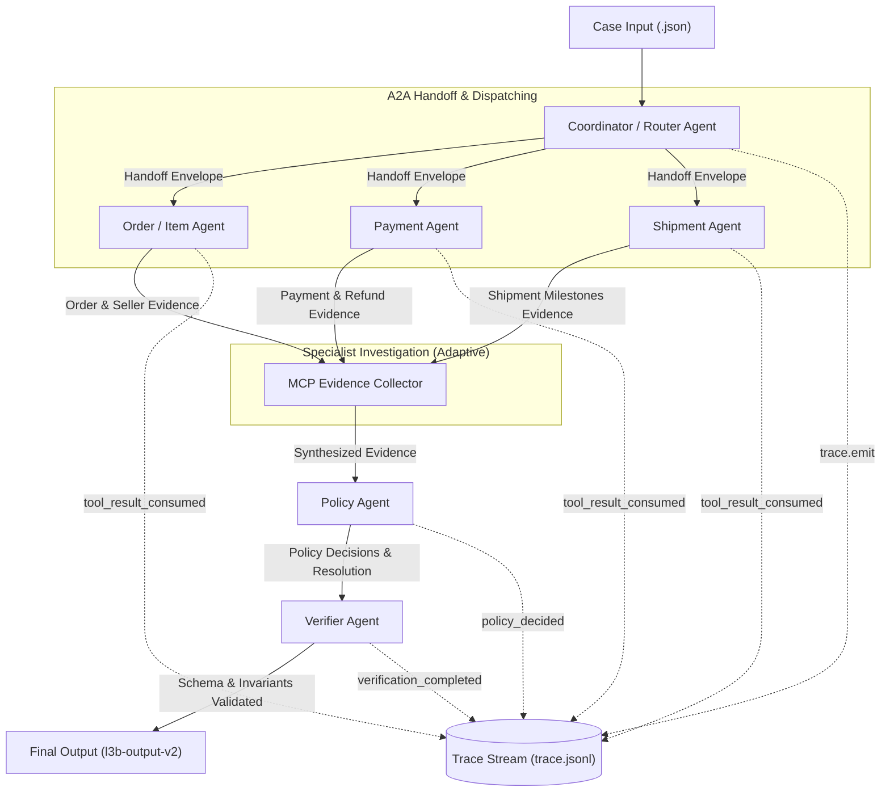

# L3B Architecture Record

Hồ sơ kiến trúc hệ thống Multi-Agent điều tra khiếu nại thương mại điện tử (K4-L3B Multi-Agent MCP + A2A).

---

## 1. System overview

Hệ thống được thiết kế theo mô hình đa tác tử hướng cộng tác A2A (Agent-to-Agent) kết hợp cổng bằng chứng MCP (Model Context Protocol). Luồng xử lý tuần tự kết hợp song song nhằm tối ưu hóa hiệu năng, giảm thiểu độ trễ và tuân thủ nguyên tắc Least Privilege (Đặc quyền tối thiểu).

### Sơ đồ kiến trúc (A2A Multi-Agent Architecture)

### Luồng vận hành chi tiết:
1. **Case Ingestion**: `cli.py` tiếp nhận case và phát sự kiện trace `case_received`.
2. **Coordinator / Router**: Giải quyết định danh (Entity Resolution) từ exact ID hoặc danh sách ứng viên (candidate IDs) và khách hàng (`customer_unique_id`). Chỉ phát `task_assigned` cho specialist thực sự được chạy.
3. **Specialist Cluster (A2A Adaptive Investigation)**:
   - `Order/Item Agent`: luôn thiết lập order context; gọi product context khi `investigation_scope` yêu cầu.
   - `Payment Agent`: chỉ chạy cho claim payment/refund, khi order authoritative là canceled/unavailable, hoặc khi cần xác minh broad unsupported claim. Refund timeline và payment timeline cũng được gọi theo nhánh liên quan.
   - `Shipment Agent`: chỉ chạy cho claim delivery hoặc broad unsupported claim.
4. **Policy Agent (MCP Evidence Collector & Decision Engine)**:
   - Thu thập toàn bộ bằng chứng từ Specialist Cluster và gọi `get_policy`.
   - Kết luận nguyên nhân gốc rễ (`root_cause_analysis`), bên chịu trách nhiệm (`responsible_parties`), xác định `primary_issue` và đưa ra giải pháp bồi hoàn (`financial_resolution`) cùng các hành động đề xuất (`resolution_actions`).
   - Phát sự kiện trace `policy_decided`.
5. **Verifier Agent (Gatekeeper & Invariants Enforcement)**:
   - Kiểm tra toàn bộ 7 Verification Invariants (tính nhất quán tài chính, sở hữu bằng chứng, phạm vi thực thể).
   - Kiểm định bắt buộc thông qua JSON Schema `l3b-output-v2.schema.json`.
   - Phát sự kiện trace `verification_completed`.
6. **Case Finalization**: `cli.py` lưu output và phát sự kiện `case_finalized`.

---

## 2. Agent ownership

Áp dụng chặt chẽ nguyên tắc **Least Privilege**: Mỗi Agent chỉ được cấp quyền truy cập các MCP tools phục vụ đúng phạm vi trách nhiệm của mình.

| Actor | Input | Trách nhiệm | Tool permission | Output / Handoff |
| --- | --- | --- | --- | --- |
| **Coordinator / Router** | Raw Case JSON (`case_id`, `order_id`, `candidate_order_ids`, `customer_unique_id`, `claims`) | - Tiếp nhận yêu cầu điều tra. - Thực hiện Entity Resolution. - Phân bổ tác vụ và chuyển giao ngữ cảnh A2A. | `get_customer_history`, `get_order` (chỉ dùng probe khi cần) | `CoordinatorHandoff` envelope (chứa `entity_resolution`, `customer_context`, `claims`) |
| **Order / Item Agent** | `resolved_order_ids`, thông tin khiếu nại đơn hàng | - Xác minh trạng thái thực tế của đơn hàng. - Thu thập mã sản phẩm (`item_ids`), mã người bán (`seller_ids`). - Tính tổng giá trị hàng và phí ship cơ bản. - Phát hiện xung đột trạng thái đơn hàng. | `get_order`, `get_order_items`, `get_product_context`, `get_sellers` | `OrderInvestigationResult` (danh sách `order_ids`, `item_ids`, `seller_ids`, tổng tiền, `data_conflicts`) |
| **Payment Agent** | `resolved_order_ids`, tổng giá trị đơn hàng kỳ vọng | - Đối soát các giao dịch thanh toán. - Tính toán `captured_total_brl`, `refunded_total_brl`, `refundable_total_brl`. - Phát hiện thanh toán trùng, lệch số tiền hoặc hoàn tiền thất bại/đang xử lý. | `get_order_payments`, `get_payment_timeline`, `get_refund_timeline` | `PaymentInvestigationResult` (mã giao dịch `payment_references`, số tiền đối soát, payment verdict) |
| **Shipment Agent** | `resolved_order_ids` | - Kiểm tra tiến độ và mốc thời gian giao nhận. - So sánh `carrier_handoff_date` với `shipping_limit_date` để tìm `late_seller_ids`. - Phân biệt trễ do người bán (`seller_delay`) hay do đơn vị vận chuyển (`logistics_delay`). | `get_shipment_summary` | `ShipmentInvestigationResult` (`shipment_ids`, `late_seller_ids`, `timeline_complete`, shipment verdict) |
| **Policy Agent** | Bằng chứng tổng hợp từ 3 Specialist Agents + khiếu nại gốc | - Tra cứu chính sách dịch vụ nền tảng. - Quyết định vấn đề cốt lõi (`primary_issue`), trạng thái case (`case_status`). - Xếp hạng nguyên nhân gốc rễ và chỉ định bên chịu trách nhiệm. - Tính toán bồi hoàn tài chính và hành động xử lý. | `get_policy` | `PolicyEvaluationResult` (`assessment`, `root_cause_analysis`, `financial_resolution`, `resolution_actions`) |
| **Conflict Resolver** | Dữ liệu không khớp giữa claim và MCP | - Áp dụng quy tắc ưu tiên nguồn (Authoritative Data Precedence). - Lập biên bản giải quyết xung đột dữ liệu. | *Không gọi MCP* (xử lý nội tại) | Danh sách bản ghi `data_conflicts` |
| **Verifier Agent** | Toàn bộ payload dự thảo từ Policy Agent | - Kiểm tra 7 Verification Invariants. - Khóa cứng cấu trúc theo schema `l3b-output-v2.schema.json`. - Kiểm toán và xác nhận toàn vẹn trace log. | *Không gọi MCP* (Gatekeeper) | JSON Output hợp lệ sẵn sàng ghi đĩa |

---

## 3. Entity resolution và A2A protocol

### 3.1 Quy trình Entity Resolution
1. **Evidence-backed Exact Match**: Nếu claimed order xuất hiện trong customer history:
   - `status = "resolved"`, `confidence = 1.0`.
   - `resolved_order_ids = [order_id]`, `rejected_candidates = candidate_order_ids \ {order_id}`.
2. **Customer History Correlation**: Nếu có `customer_unique_id`:
   - Coordinator gọi `get_customer_history`.
   - Đối chiếu danh sách `candidate_order_ids` với lịch sử đơn hàng của khách hàng.
   - Nếu khớp chính xác 1 đơn hàng: `status = "resolved"`, `confidence = 0.95`.
   - Nếu khớp nhiều hơn 1 đơn hàng khả dĩ: `status = "ambiguous"`, `confidence = 0.50`, ưu tiên đơn hàng gần nhất và đưa các đơn còn lại vào `rejected_candidates`.
3. **Active Probing**: Nếu lịch sử không xác nhận ứng viên nhưng có candidate hợp lệ:
   - Gọi `get_order` cho ứng viên tốt nhất. Chỉ khi MCP trả về order context mới gán `resolved`, `confidence = 0.85`; kết quả được cache để Order Agent không gọi lặp.
4. **Not Found**: Nếu không tìm thấy bất kỳ liên kết hợp lệ nào:
   - `status = "not_found"`, `confidence = 0.0`.
   - `resolved_order_ids = []`, toàn bộ ứng viên chuyển vào `rejected_candidates`.

### 3.2 A2A Communication Protocol & Correlation
- **Correlation ID**: Mọi tin nhắn và tương tác giữa các Agent đều gắn kèm `case_id` làm khóa định danh duy nhất.
- **Message Envelope**: Sử dụng cấu trúc phong bì `CoordinatorHandoff` chứa dữ liệu đã xác thực, ngăn ngừa rò rỉ trạng thái ngầm.
- **Tránh vòng lặp (Cycle Prevention)**: Luồng điều phối đi theo một chiều dạng DAG (Directed Acyclic Graph): Coordinator → Parallel Specialists → Policy → Verifier. Không có cơ chế quay vòng ngược (no backward handoff loop).

---

## 4. Evidence và conflict lifecycle

### 4.1 Quản lý Bằng chứng (Evidence Lifecycle)
1. **Validation**: Mọi phản hồi từ MCP Gateway đều được kiểm tra ngay lập tức qua `mcp-evidence-response-v1.schema.json` trước khi tiêu thụ.
2. **Traceability**: Mỗi khi một Agent sử dụng kết quả MCP, `ResilientGatewayClient` tự động ghi nhận sự kiện `tool_result_consumed` với đúng `actor`, `tool_name` và `evidence_refs`.
3. **Per-case Isolation**: Khóa `collected_evidence_refs` được khởi tạo mới trên từng case riêng biệt. Tuyệt đối không tái sử dụng `evidence_ref` giữa các case để tránh vi phạm quy tắc cross-scope (Hard Gate).

### 4.2 Xử lý xung đột nguồn (Data Conflict Resolution)
- **Nguyên tắc ưu tiên nguồn (Source Precedence)**: Dữ liệu định danh chính thức từ cơ sở dữ liệu MCP (`mcp_get_order`, `mcp_get_payment_timeline`, `mcp_get_shipment_summary`) luôn có giá trị pháp lý cao hơn thông tin tự khai báo từ phía khách hàng (`case_claim`).
- **Conflict Recording**: Khi phát hiện sai lệch (ví dụ: khách hàng khiếu nại hàng bị hủy nhưng hệ thống ghi nhận đã giao thành công), hệ thống ghi nhận vào mảng `data_conflicts`:
  - `field`: Tên trường xung đột (ví dụ: `"order_status"`).
  - `sources`: Nguồn gốc thông tin mâu thuẫn `["case_claim", "mcp_get_order"]`.
  - `selected_source`: Nguồn được chọn `"mcp_get_order"`.
  - `resolution_code`: `"AUTHORITATIVE_ORDER_ROW_PRECEDENCE"`.

---

## 5. Failure and efficiency policy

### 5.1 Bảng xử lý sự cố (Failure Handling Policy)

| Loại sự cố | Ngân sách Retry | Chiến lược Fallback | Trace Event / Decision Code |
| --- | ---: | --- | --- |
| **MCP Timeout / Network Error** | 2 lần (Exponential backoff 0.5s, 1.0s) | Đánh dấu verdict tương ứng là `"insufficient_evidence"`, không sinh dữ liệu giả | Silent retry nội bộ; fallback ghi nhận vào verdict |
| **Entity Not Found / Ambiguous** | 1 lần probe | Đặt trạng thái `not_found` hoặc `ambiguous`, đề xuất hành động yêu cầu bổ sung thông tin từ khách | `policy_decided` với mã `INSUFFICIENT_EVIDENCE` |
| **Data Conflict** | 0 lần | Tự động áp dụng quyền ưu tiên của nguồn chính thức (Authoritative Precedence) | Ghi nhận vào `data_conflicts` |
| **Invalid Specialist Result** | 0 lần | Thu hồi về trạng thái an toàn bảo thủ (`needs_investigation`), refund = 0 | `verification_completed` với cờ hiệu bảo toàn |

### 5.2 Chiến lược tối ưu chi phí gọi MCP (Query Budget & Cache Strategy)
- **In-Memory Per-Case Cache**: Toàn bộ lượt gọi tool được lưu bộ nhớ đệm theo bộ ba `(tool_name, case_id, sorted_args)`. Nếu một tool đã được gọi với cùng tham số trong cùng case, kết quả được trả về ngay lập tức từ cache, không phát sinh call tới gateway.
- **Minimum Sufficient Evidence**: Order context được lấy trước; claim topic và trạng thái order quyết định có chạy Payment/Refund hoặc Shipment hay không. Product context chỉ được lấy khi scope yêu cầu. Không gọi quét rộng hay gọi timeline “just in case”.

---

## 6. Verification invariants

Trước khi chuyển giao output cho `cli.py` lưu trữ, `VerifierAgent` bắt buộc kiểm tra và bảo đảm toàn bộ 7 bất biến sau:

1. **Schema Compliance**: Payload bắt buộc vượt qua kiểm định của `l3b-output-v2.schema.json`. Không chứa bất kỳ thuộc tính nào nằm ngoài định nghĩa (`additionalProperties: false`).
2. **Entity Scope & Uniqueness**: Mọi mảng ID trong `affected_entities` (`order_ids`, `item_ids`, `seller_ids`, `payment_references`, `shipment_ids`) phải được loại bỏ trùng lặp (`uniqueItems: true`) và thuộc phạm vi case.
3. **Candidate Disjointness**: Tập hợp `resolved_order_ids` và `rejected_candidates` phải rời nhau hoàn toàn:
   $$\text{resolved\_order\_ids} \cap \text{rejected\_candidates} = \emptyset$$
4. **Evidence Provenance & Ownership**: Mọi mã `evidence_refs` đưa vào output phải nằm trong tập hợp các bằng chứng thực tế được sinh ra bởi MCP Gateway trong chính phiên xử lý case đó.
5. **Financial Reconciliation**:
   - Số tiền bồi hoàn đề xuất phải bằng tổng các dòng chi tiết:
     $$\text{recommended\_refund\_brl} = \sum \text{line.amount\_brl}$$
   - Số tiền bồi hoàn không được vượt quá số tiền có thể hoàn trả:
     $$\text{recommended\_refund\_brl} \le \text{refundable\_total\_brl}$$
   - Nếu `case_status == "no_action"` thì bắt buộc `recommended_refund_brl == 0.0` và `refund_lines = []`.
6. **Responsibility & Action Consistency**:
   - Nếu có `late_seller_ids`, danh sách `responsible_parties` phải chứa thực thể `seller` tương ứng.
   - Nếu nguyên nhân là `logistics_delay`, danh sách `responsible_parties` phải chứa `logistics_provider`.
   - Các chuỗi hành động trong `resolution_actions` không được vượt quá 8 và không được trùng lặp.
7. **Trace Lifecycle Completeness**: Chuỗi sự kiện trace cho mỗi case phải đảm bảo đầy đủ và đúng thứ tự:
   $$\text{case\_received} \to \text{task\_assigned} \to \text{handoff} \to \text{tool\_result\_consumed} \to \text{policy\_decided} \to \text{verification\_completed} \to \text{case\_finalized}$$

---

## 7. Reproducibility

- **Môi trường thực thi**: Python 3.11.9 trên nền tảng x86_64 / Windows hoặc Linux.
- **Quản lý phụ thuộc (Pinned Dependencies)**:
  - `httpx2 >= 2, < 3`
  - `mcp >= 2, < 3`
  - `jsonschema[format] >= 4.25, < 5`
  - `python-dotenv >= 1.1, < 2`
  - `pytest >= 8.4, < 9`
  - `ruff >= 0.12, < 1`
- **Tính tiền định (Deterministic Execution)**: Hệ thống sử dụng quy tắc logic thuần túy (Deterministic State-Machine & Rule-based Policy), không phụ thuộc vào random seed hay nhiệt độ suy diễn ngẫu nhiên, đảm bảo cùng một bộ input và evidence sẽ luôn tạo ra kết quả 100% đồng nhất giữa các lần chạy.
- **Bảo mật**: Tuyệt đối không ghi thông tin bí mật, khóa `COMPETITION_TEAM_API_KEY` hay prompt suy luận nội bộ vào mã nguồn, trace log hoặc gói submission.
